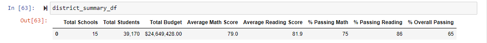
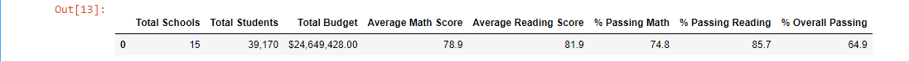
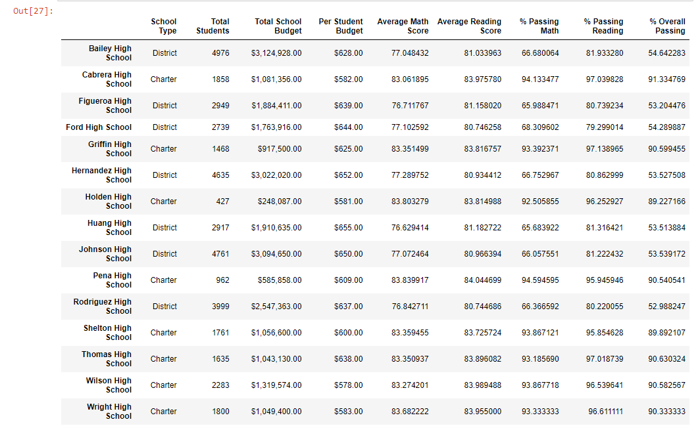
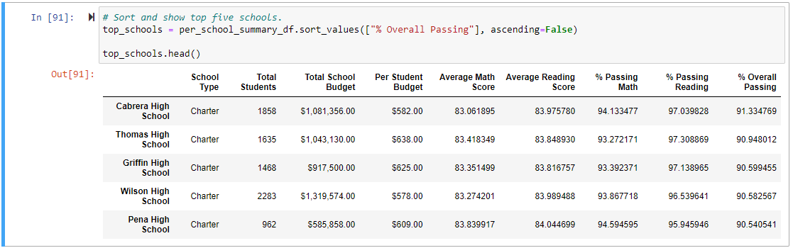
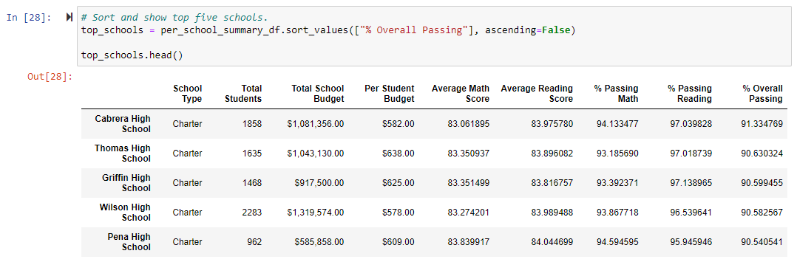
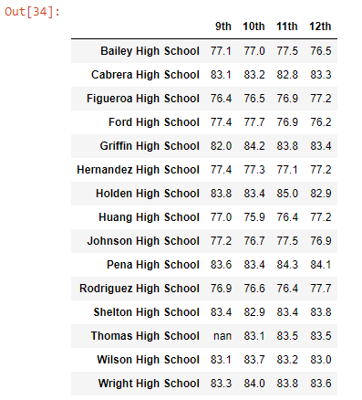
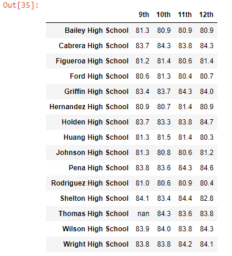
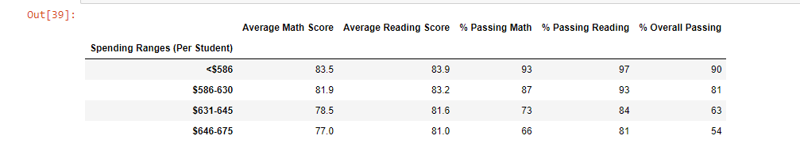
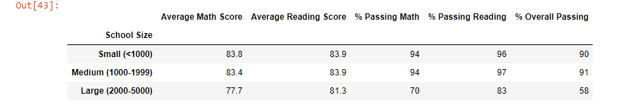
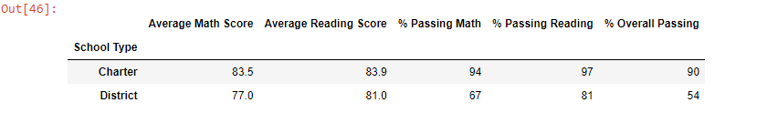

# School_District_Analysis
## Overview
The purpose of this analysis is to provide client Maria with clearly defined data regarding school district math and reading scores. After the initial analysis was complete, it was found that Thomas High School's ninth grade math and reading scores were compromised, so they were removed (replaced with NaNs) and the analysis was reperformed.
## Results
* How is the district summary affected?
As per the screenshot below, prior to the removal of the Math and Reading scores,  the average Math Score was 79.0, the average Reading Score was 81.9, the passing Math Percentage was 75%, the passing Reading percentage was 86%, and the overall Passing Percentage was 65%.

After the removal of the Thomas High School 9th grade class scores, there were subtle changes in some of the data. The Average Math Score dropped to 78.9, the Average Reading Score remained the same at 81.9, the Passing Math Percentage dropped to 74.8 and the Passing Reading Percentage dropped from 86 to 85.7. The Overall Passing Percentage barely decreased, from 65 to 64.9. 

Overall, the district scores appear to be very minimally affected by replacing the Thomas High School ninth grader scores with NaNs. 

* How is the school summary affected?

Below is a screenshot of the individual school summaries before the ninth grader Thomas High School scores were replaced with NaNs.

Alternatively, below is a screenshot of the individual school summaries after the ninth grader Thomas High School scores were replaced with NaNs. 

The differences at the school summary level are entirely exclusive to Thomas High School. Average Reading Score increased from 83.85 to 83.89, the Average Math Score dropped from 83.41 to 83.35, Percentage Passing Math lowered from 93.27% to 93.19% and Percentage Passing Reading decreased from 97.30% to 97.01%. Overall Passing also decreased, from 90.95% to 90.63%. None of these changes are drastically different and do not affect the analysis immensely.

* How does replacing the ninth graders' math and reading scores affect Thomas High School's performance relative to the other schools?

As shown in the screen shot above, Thomas High School was ranked as the 2nd school in the district. In the screenshot below, which is the ranking after the ninth grade scores were replaced for Thomas High School, we do see a decrease in overall passing percentage, however, Thomas High School remains the 2nd place school in the district.

* How does replacing the ninth-grade scores affect the following:
     - Math and reading scores by grade?
     All district scores remain the same except for Thomas High School, which shows NaN for the 9th grade math and reading scores.
     
     Math scores:
     
     
     Reading Scores:
     
      
     - Scores by school spending?
     Scores by school spending were not affected by replacing the ninth grade scores for Thomas High School. The schools with the highest passing percentage fall into the <$584 bin, which is counter to what one would expect.
     
     
     - Scores by school size?
     Scores by school size were not affected by replacing ninth grade scores for Thomas High School. Small and Medium schools have a very close overall passing rate, however Medium schools, of which Thomas High School is one, win by a mere percentage point.
     
     
     - Scores by school type?
     Scores by school type were not affected by replacing ninth grade scores for Thomas High School. As one would expect, Charter schools have a higher overall passing rate. Thomas High School is a charter school, and the 2nd ranked school in the district.
     

## Summary

* Summarize four changes in the updated school district analysis after reading and math scores for the ninth grade at Thomas High School have been replaced with NaNs.
     - The number of students from Thomas High School
     - The Passing Math percentage dropped for the district
     - The Passing Reading percentage dropped for the district
     - The overall passing percentage for Thomas High School dropped slightly.
